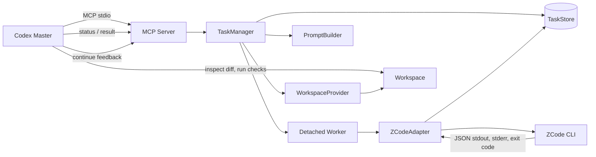
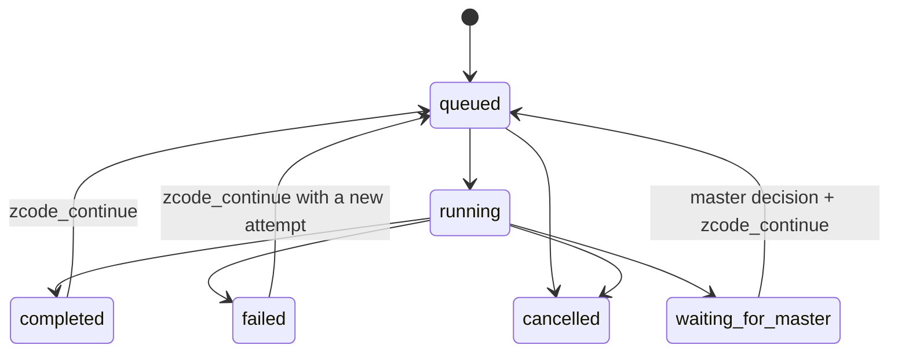

# Codex → ZCode Bridge: V0.1 Architecture

**Status: FROZEN for V0.1 implementation**

Version: 0.1.0

Date: 2026-09-26

Changes to the frozen boundaries or tool contracts require an explicit architecture update. Internal implementation details can change if they preserve the contracts below.

## Goal and non-goals

Codex is the sole master. The Bridge accepts bounded tasks from Codex, runs one local ZCode CLI task at a time, persists execution evidence, and returns normalized results. Codex reviews the workspace diff and verifies acceptance criteria before deciding PASS or asking for a continuation.

V0.1 includes stdio MCP, one local ZCode runtime, direct workspace mode, durable task records, task/status/result/continue/cancel tools, process timeout/cancellation, and a disposable-project integration test.

V0.1 excludes UI, remote execution, databases, multiple concurrent ZCode workers, PR automation, and OS-enforced per-path sandboxing. Git worktree/clone execution remains a future `WorkspaceProvider` implementation.

## Components

1. **MCP server** — stdio transport and strict tool schemas only. It delegates calls to `TaskManager` and returns MCP text plus structured content.
2. **TaskManager** — validates requests, allocates the one V0.1 worker slot, persists state, launches/reconciles workers, and enforces state transitions.
3. **TaskStore** — file-backed records under `<bridge-data-root>/.tasks/<task_id>/`: `task.json`, `status.json`, append-only `stdout.log` / `stderr.log`, and terminal `result.json`. Status/result updates use temp-file-plus-rename. The default data root is the Bridge installation directory; `ZCODE_BRIDGE_DATA_DIR` may override it. `.tasks/` is ignored by Git.
4. **WorkspaceProvider** — resolves a requested workspace to a canonical existing directory. V0.1 provides `DirectWorkspaceProvider`; it does not create or delete the task workspace.
5. **CodingAgentAdapter** — stable provider-neutral contract. `ZCodeAdapter` resolves and validates ZCode runtime configuration, constructs argv, invokes the CLI, parses its machine envelope, and normalizes the subordinate report.
6. **Worker process** — one detached Bridge worker per active task, with at most one active worker globally. It owns the ZCode child process and persists progress/results so MCP server restarts do not erase task evidence. On restart, the manager reconciles the persisted worker PID and task state.
7. **PromptBuilder** — renders the task package and continuation feedback as a bounded subordinate-coder prompt. It asks for a JSON report embedded in the ZCode `response`; it does not treat that report as a correctness verdict.

## Data flow

## Frozen runtime behavior

- Run the verified Node executable and full `zcode.cjs` path with `spawn(executable, args, { shell: false, cwd })`; never construct a shell command string.
- V0.1 invocation is `--prompt <text> --json --mode yolo --cwd <canonical workspace>`; continuation adds `--resume <sessionId>`. Resume must use the same canonical workspace. The returned session ID must equal the requested one before the Bridge claims the session continued.
- The prompt is written to a uniquely named temporary UTF-8 file and loaded by a short Node bootstrap so the full prompt does not appear in process argv. Keep it until the child exits, then remove it in `finally`.
- Resolve `zcode.cjs`, Node, and Bridge data root from `ZCODE_BRIDGE_ZCODE_CJS`, `ZCODE_BRIDGE_NODE`, and `ZCODE_BRIDGE_DATA_DIR` when set; otherwise discover the installed runtime, use `node` on PATH, and default data to the Bridge installation directory. Configure provider paths only in the ZCode child environment. Both `ZCODE_BUILTIN_PROVIDER_CONFIG_FILE` and `ZCODE_PERSONAL_PROVIDER_CONFIG_FILE` must be present and resolve to readable, valid files. Prefer a valid inherited pair; otherwise resolve the builtin path from the ZCode installation and the personal path from `ZCODE_DATA_BASE_DIR` or an explicit `ZCODE_PERSONAL_PROVIDER_CONFIG_FILE`. Fail with a distinct configuration error if the personal file cannot be identified. Never copy or edit ZCode installation/config files, log provider contents, or silently select a known stub.
- `--max-turns` is not supported by the verified CLI; Bridge enforces a wall-clock timeout. Timeout/cancel must terminate the Windows process tree and verify termination before writing a terminal state.
- Exit 0 is necessary but not sufficient. Parse exactly one JSON envelope; require `sessionId` and `response`, validate the expected optional fields, then normalize the report. Preserve bounded raw logs and fail normalization if the report is absent or malformed.
- Retry only the observed transient “Bundled 与 Active ZCode Built-in Release 均不可用” failure, at most twice with a short backoff. Do not retry provider/path/model-creation errors. This policy is version-specific and should be revisited after ZCode upgrades.

## Task lifecycle

`completed` means the ZCode invocation and result normalization completed. It does **not** mean Codex accepted the code. `waiting_for_master` means ZCode reported `needs_master_decision=true`. Only Codex may decide PASS. A continuation increments the attempt number and preserves earlier attempt evidence; it uses `--resume` when a verified session ID is available, otherwise a new CLI session receives the prior task summary and feedback.

`zcode_cancel` on a queued task cancels it immediately. On a running task, persist cancellation intent, kill and verify the worker process tree, then record `cancelled`. A task with a missing/dead worker and no terminal result is reconciled to `failed` with `worker_lost`.

## Workspace and security boundaries

- `workspace` must be absolute, exist, resolve to a directory, and be canonicalized before launch. Continuation cannot switch workspace.
- `allowed_paths` and `forbidden_paths` are prompt constraints in Direct mode, not an OS sandbox. The Bridge records them and reports observed out-of-scope changes when it can compute a diff; it cannot prevent or roll back such writes. This limitation is returned to Codex and documented to the user.
- Task prompts and logs may contain source code. Keep them local, bound log size, do not log credential values, and do not persist full child environment variables.
- ZCode runs in `yolo` mode because unattended task execution and tests are part of the requested V0.1 loop. Codex must only dispatch tasks already authorized by the user and must review changes independently.
- The MCP server has no network listener; stdio is the only V0.1 transport.

## Failure handling

Persist `error_code`, safe error text, start/finish timestamps, worker PID, ZCode exit code, and attempt number. Keep stdout/stderr separate. Distinguish `runtime_not_found`, `provider_config_missing`, `provider_config_invalid`, `spawn_failed`, `timeout`, `cancelled`, `worker_lost`, `invalid_json`, `invalid_agent_report`, and `zcode_nonzero_exit`. Do not turn malformed output or nonzero exit into a completed task.

## Verification boundary

Unit tests use a fake `CodingAgentAdapter` and do not spend model quota. The live integration test uses a fresh temporary Python project and verifies file changes and tests independently. Codex remains responsible for inspecting the diff, rerunning acceptance checks, and deciding whether to continue or PASS.

Runtime evidence and unresolved version-specific details are in [ZCODE_RUNTIME.md](ZCODE_RUNTIME.md). Research findings are in [RESEARCH.md](RESEARCH.md).
