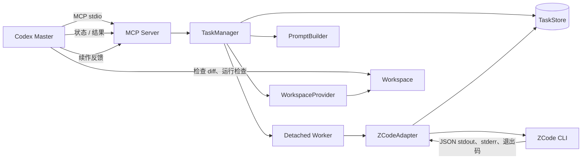
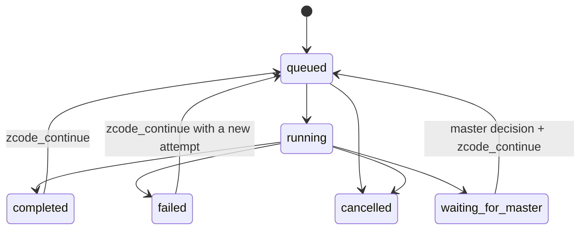

# Codex → ZCode Bridge：V0.1 架构

**状态：V0.1 实现范围已冻结**

版本：0.1.0
日期：2026-09-26

修改冻结边界或工具契约前，必须显式更新架构。只要不改变下文契约，内部实现细节可以调整。

## 目标与非目标

Codex 是唯一的 Master。Bridge 接收 Codex 提交的有界任务，每次运行一个本地 ZCode CLI 任务，持久化执行证据并返回规范化结果。Codex 检查工作区 diff 并验证验收标准，然后决定是否 PASS 或要求续作。

V0.1 包含 stdio MCP、一个本地 ZCode runtime、直接工作区模式、持久化任务记录、任务/状态/结果/续作/取消工具、进程超时与取消，以及临时项目集成测试。

V0.1 不包含 UI、远程执行、数据库、多个并发 ZCode worker、PR 自动化和操作系统强制的逐路径沙箱。Git worktree/clone 执行留待未来实现 `WorkspaceProvider`。

## 组件

1. **MCP server** — 只负责 stdio 传输和严格工具 schema。将调用委托给 `TaskManager`，并返回 MCP 文本及结构化内容。
2. **TaskManager** — 校验请求、分配 V0.1 唯一 worker 槽位、持久化状态、启动/恢复 worker，并执行状态转换规则。
3. **TaskStore** — 将记录存放在 `<bridge-data-root>/.tasks/<task_id>/`：`task.json`、`status.json`、只追加的 `stdout.log` / `stderr.log` 和终态 `result.json`。状态和结果通过临时文件加 rename 更新。默认数据根目录是 Bridge 安装目录；可用 `ZCODE_BRIDGE_DATA_DIR` 覆盖。Git 忽略 `.tasks/`。
4. **WorkspaceProvider** — 将请求的工作区解析为规范化且已存在的目录。V0.1 提供 `DirectWorkspaceProvider`，不会创建或删除任务工作区。
5. **CodingAgentAdapter** — 稳定且与 provider 无关的契约。`ZCodeAdapter` 解析并验证 ZCode runtime 配置、构建 argv、调用 CLI、解析机器可读封装并规范化下属 Agent 报告。
6. **Worker 进程** — 每个活动任务使用一个 detached Bridge worker，全局最多一个。它负责 ZCode 子进程，并持久化进度和结果，避免 MCP server 重启导致证据丢失。重启时，manager 根据已保存的 worker PID 和任务状态进行恢复。
7. **PromptBuilder** — 将任务包及续作反馈渲染为有界的下属 coder prompt。要求 ZCode 在 `response` 中返回 JSON 报告，但不将报告视为正确性结论。

## 数据流

## 冻结的 runtime 行为

- 使用已验证的 Node 可执行文件和完整 `zcode.cjs` 路径，并调用 `spawn(executable, args, { shell: false, cwd })`；不得拼接 shell 命令字符串。
- V0.1 调用参数为 `--prompt <text> --json --mode yolo --cwd <canonical workspace>`；续作增加 `--resume <sessionId>`。恢复时必须使用同一规范工作区。只有返回的 session ID 与请求值一致，Bridge 才能声称恢复了原 session。启动任务前必须显式设置 `ZCODE_BRIDGE_ALLOW_UNRESTRICTED_EXECUTION=1`。
- Prompt 写入唯一命名的 UTF-8 临时文件，再由简短 Node bootstrap 加载，避免完整 prompt 出现在进程 argv 中。保留文件直到子进程退出，并在 `finally` 中删除。
- 如果设置了 `ZCODE_BRIDGE_ZCODE_CJS`、`ZCODE_BRIDGE_NODE`、`ZCODE_BRIDGE_DATA_DIR`，就用它们解析 `zcode.cjs`、Node 和 Bridge 数据根目录；否则发现已安装 runtime、从 PATH 使用 `node`，并将数据根目录设为 Bridge 安装目录。Provider 路径只配置在 ZCode 子进程环境中。`ZCODE_BUILTIN_PROVIDER_CONFIG_FILE` 和 `ZCODE_PERSONAL_PROVIDER_CONFIG_FILE` 必须同时存在，且都解析到可读取的有效文件。优先使用有效的继承变量；否则从 ZCode 安装位置解析 builtin 路径，并从 `ZCODE_DATA_BASE_DIR` 或显式的 `ZCODE_PERSONAL_PROVIDER_CONFIG_FILE` 解析个人配置。如果无法确定个人配置文件，返回独立的配置错误。不得复制或修改 ZCode 安装/配置文件，不得记录 provider 内容，也不得静默选用已知无效的 stub。
- 已验证的 CLI 不支持 `--max-turns`；Bridge 使用墙钟超时。超时/取消必须终止 Windows 整个进程树，并在写入终态前确认进程树已停止。
- 退出码为 0 是必要条件，但不足以判定成功。只解析一个 JSON envelope；要求存在 `sessionId` 和 `response`，验证预期可选字段，然后规范化报告。保留有界原始日志；报告缺失或格式错误时，规范化必须失败。
- 只对观察到的临时错误 `Bundled 与 Active ZCode Built-in Release 均不可用` 重试，最多两次并采用短暂退避。Provider/路径/model 创建错误不重试。该策略与版本有关，ZCode 升级后应重新检查。

## 任务生命周期

`completed` 表示 ZCode 调用和结果规范化已完成，**不**表示 Codex 接受了代码。`waiting_for_master` 表示 ZCode 报告 `needs_master_decision=true`。只有 Codex 可以决定 PASS。续作会增加 attempt 编号并保留之前的 attempt 证据；存在已验证 session ID 时使用 `--resume`，否则创建新的 CLI session，并在 prompt 中包含原任务摘要和反馈。

排队中的任务调用 `zcode_cancel` 会立即取消。运行中任务先持久化取消意图，再终止并确认 worker 进程树，最后写入 `cancelled`。如果 worker 已消失且没有终态结果，则恢复逻辑将其标记为 `failed`，错误为 `worker_lost`。

## 工作区与安全边界

- `workspace` 必须是绝对路径、已经存在、解析为目录，并在启动前规范化。续作不能切换工作区。
- Direct 模式中的 `allowed_paths` 和 `forbidden_paths` 是 prompt 限制，不是 OS 沙箱。Bridge 会记录这些约束，并在能够计算 diff 时报告越界改动；它无法阻止或回滚写入。此限制会返回给 Codex 并告知用户。
- 任务 prompt 和日志可能包含源代码。保持数据本地、限制日志大小，不记录凭据值，也不持久化完整子进程环境变量。
- 当前 ZCode session 固定使用 `yolo` 模式；该模式与 Git worktree 均不是操作系统沙箱。Bridge 默认拒绝启动，只有显式设置 `ZCODE_BRIDGE_ALLOW_UNRESTRICTED_EXECUTION=1` 才运行。Codex 只能派发用户已授权的任务，并必须独立审查改动。
- Detached worker 和 ZCode 子进程只接收必要的 OS 环境变量及明确列出的 Bridge/provider 路径，避免任意继承父进程中的 API token 等变量。provider 配置内容不写入 worker environment。
- Git task snapshot 使用临时 index，并排除常见凭据路径和文件扩展名；这是启发式保护，不是完整 secret scanner。Git clean filters 会在排除之前随 `git add` 执行。
- MCP server 不监听网络；V0.1 只使用 stdio 传输。

## 故障处理

持久化 `error_code`、安全错误文本、开始/结束时间、worker PID、ZCode 退出码和 attempt 编号。stdout 与 stderr 分开保存。区分 `runtime_not_found`、`provider_config_missing`、`provider_config_invalid`、`spawn_failed`、`timeout`、`cancelled`、`worker_lost`、`invalid_json`、`invalid_agent_report` 和 `zcode_nonzero_exit`。不得将格式错误的输出或非零退出码转为已完成任务。

## 验证边界

单元测试使用 fake `CodingAgentAdapter`，不消耗模型额度。真实集成测试使用新建的临时 Python 项目，并独立检查文件改动和测试结果。Codex 仍需检查 diff、重新运行验收检查，并决定是否续作或 PASS。

runtime 证据和未解决的版本相关细节见 [ZCode Runtime 验证](ZCODE_RUNTIME.md)，调研结果见 [Phase 1 调研](RESEARCH.md)。
