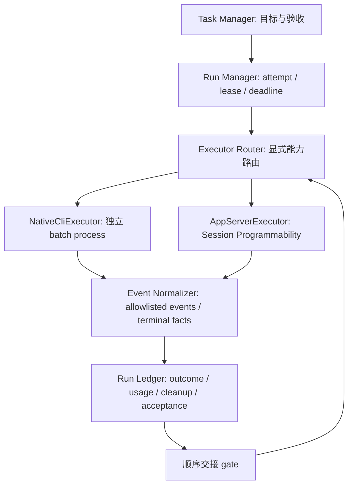

# Executor 架构建议与决策门槛

**决策：GO WITH CONDITIONS。** 引入 NativeCliExecutor 的候选实现、保留 AppServerExecutor、建立统一 Run Ledger 与顺序 Handoff，方向合理；本次仅给研究方案。当前没有足够证据把 Native 切成默认 Coding Executor，生产默认继续 app-server。跨 Host concurrent attach/control 为 **NO-GO**，除非上游提供明确 ownership/control 协议或另行证明安全。

## 15 个问题的直接回答

| # | 问题 | 回答 |
|---|---|---|
| 1 | 共享 Agent Core？ | 是，固定官方源码两条路径汇合于 AgentRuntime.executeTurn / 同一 loop / model runner；SOURCE |
| 2 | 真正分叉点？ | Host bootstrap、runtime materialization、输入 admission、能力 broker、preferences、收口与进程管理；不是一个独立 Coding engine |
| 3 | System Prompt 一致？ | 自然配置不一致；对齐 Memory 后所测 system 哈希相同。完整 context 未证明普遍一致；RUNTIME / UNKNOWN |
| 4 | Tools 一致？ | 自然列表不同；规范化 4 工具 schema 相同。可执行 policy、Browser/MCP/Workflow ports 仍须 separately 校准 |
| 5 | Model Execution 一致？ | 所测 Flash + low/high/max 的 body selection/effort 映射一致；auth、背景模型、上下文及辅助调用不保证一致 |
| 6 | Native 为什么可能省 Token？ | 某任务少一次模型调用可节省大 context 的重复输入；复用官方 Host 可能减少错误重建。前者 T3 观测成立，普遍解释仍 HYPOTHESIS；总体观察组 A 更少 |
| 7 | Native 为什么可能质量更高？ | 尚不确定；此样本均通过、评分相同。permission/MCP/context 等对齐前不能归因于入口 |
| 8 | 已证实 vs 猜测？ | shared Core、自然工具/Memory/policy差异、档位映射、顺序恢复已证实；整体优劣、资源优劣、后台差异因果、完整无损仍未知 |
| 9 | CLI → app-server Handoff？ | 是，成功完成的所测会话跨进程恢复、marker/历史/Read-Edit state/选择保持；RUNTIME |
| 10 | app-server → CLI？ | 是，close 后仍可恢复；本次显式 yolo override；RUNTIME |
| 11 | running CLI 能 attach？ | 另一 Host 能 list，read/stop 不激活；安全并发 resume NOT RUN。没有已验证 attach/control 通道，不启用 |
| 12 | 应采用双 Executor？ | GO WITH CONDITIONS：作为能力路由候选，须完成版本门槛、normalization、terminal、cleanup、lease、真实负载验证 |
| 13 | 默认 Coding Executor？ | 现在继续 app-server；Native 先 opt-in batch pilot。不能凭未成立的成本/质量优势直接切换 |
| 14 | app-server 职责？ | 长会话、运行中交互与审批、动态模型/思考档位、steering、子会话检查、事件回放与细粒度读取 |
| 15 | 保留现有 Bridge 能力？ | Provider/account/revision/ID mapping、模型目录预检、workspace身份/执行目录、Task/Attempt隔离、规范报告、事件seq/turn去重与回放、timeout/cancel、outcome checkpoint、cleanupVerified、usage隐私白名单 |

## 候选职责边界

路由按任务能力选择：确定需求且无需执行中审批/steering 的 acceptance-driven batch 可以试用 Native；需要保留活动会话或动态控制时 app-server 更合适。不要把“任务叫 bug fix”直接当必须 Native 的规则，也不要在同一 attempt 未知状态时启动另一 Executor 重跑。

Native stream-json 是结构化 Runtime 输出，有实现基础；实际流可能包含 Provider 请求相关字段，所以要像现有 Bridge 一样做安全白名单，不原样转发 stdout。不能因“结构化”便假定没有 headers、隐私或隐藏推理风险。最终 result、process exit、cleanup 与验收分别入账。

## 正确的完成状态

建议 Run Manager 用事实门槛，而非仅事件名：

1. 主输入有已关联的 terminal result；event seq、turnId 不把回放旧事件当新结果。
2. 若允许 Workflow/subagent/background，确认该 run 所拥有工作均完成、失败或被明确取消。无可靠观测时标 incomplete，不能只等待固定几秒冒充 settle。
3. 显式决定 Memory extraction / title / summary 等辅助请求是否属于 run 成本及 terminal 门槛；按 querySource 分账。
4. 保存 outcome、报告与已知 usage，之后释放 Runtime/进程；cleanupUnknown 不清空 workspace occupied。
5. Reviewer 另行验收。模型 success、进程 exit0、cleanupVerified、acceptancePassed 是四个不同事实。

Native 官方 settle 有条件且没有内部总 deadline；app-server `session/send` ACK 更不能当完成。现有 Bridge 已有 checkpoint 与 cleanupVerified，扩展时应保留，不另造丢结果的收口逻辑。

## Windows 进程控制

| 操作 | Native CLI 实测 | app-server 实测 | 结论边界 |
|---|---|---|---|
| spawn / PID / streams | 独立 Node→CLI，采集 stream-json；prompt经文件loader避免argv泄露 | 独立 Node→app-server stdio JSON-RPC | 两者都可被外部 Supervisor 管理 |
| Agent cancellation | 本次未测试 Native 优雅交互取消 | `session/stop` ACK 36ms，随后 terminal=cancelled，1秒观察后 60秒 helper 已死 | stop成功不终止 server；ACK 不等于进程树清理 |
| OS force cancel | 自建 Bash→Node 60秒 helper；`taskkill /PID /T /F` 359ms，helper 死、无 done marker | stop后 server仍活；关闭stdin后 parent exit0，parent/helper均死 | 一个特定树成功，不保证所有任意 detached child |
| Ctrl+C / Ctrl+Break | NOT RUN | NOT RUN | Node SIGINT/SIGTERM 名字不能替代 Windows Console Control Event 语义 |
| Timeout | Native 300秒研究deadline触发taskkill；保留未完成ledger | 协议失败/停止与父进程释放分开记录 | 全生命周期必须有budget与终止升级 |
| Job Object | 专用 helper 树：assign成功、kill-on-close、parent/child均死 | 未集成实际 ZCode | 证明 Windows机制可行，不是生产ZCode已验证 |
| CPU / RAM | 未测 | 未测 | 不确定哪边更省操作系统资源 |

Windows Job Object 可约束子进程并支持 kill-on-job-close、资源 accounting；适用于两种 Executor，不专属于 CLI。[Microsoft Job Objects](https://learn.microsoft.com/en-us/windows/win32/procthread/job-objects)。实际集成应在 root spawn前后提供可靠 containment，最好 suspended create→assign→resume 或受控握手，以免先创建的孩子逃逸；检查 nested Job、breakaway、权限和实际 shell/browser 派生。工具根退出不保证 orphan 已被杀，须验证 Job 内外进程状态。

本次 Job helper 首轮 P/Invoke harness 的嵌套 struct 赋值没持久化，导致 kill-on-close 未生效；已修正，并以 finally 清理自有树。最终成功实验保存错误与修正范围，不掩盖初次失败。Windows Ctrl+C / Break 需要 console process-group 与特定条件，[Microsoft GenerateConsoleCtrlEvent](https://learn.microsoft.com/en-us/windows/console/generateconsolectrlevent)；不能把 Node `kill('SIGTERM')` 宣称为同等优雅控制。

现有 Bridge 的 app-server 适配器本身每次 run 启动进程并带 deadline / process-tree cleanup。不存在“app-server先天不能受OS管理”的证据。差别主要是 Native batch 的自然进程终态与 app-server 长会话的 Agent-level 终态，需要 Host 对齐生命周期。

## GO 的前置条件

| 门槛 | 必须交付的证据 |
|---|---|
| 版本与 capabilities | 固定实际bundle/version/hash，入口flags/RPC能力预检；源码与安装版差异有明确fallback |
| Model normalization | Provider、model、reasoning、auth、default选取、辅助模型来源记录；不能只比较modelId |
| Context / tool normalization | 保存各分段及schema安全哈希，显式Memory use/extraction、AGENTS、skills、MCP、Browser、Workflow/subagent policy |
| terminal | 主turn与run完成分离；背景负载真实探针；失联后unknown而非盲重跑 |
| cleanup | 两种实际ZCode进程包含shell/helper/browser并完成deadline、取消、强杀、orphan检查；JobObject集成NOT RUN待完成 |
| handoff | 唯一session/workspace lease、旧Host释放后恢复；持久化及文件状态复核；不并发resume |
| quality / economics | 至少10个来自真实生产任务的扩展负载，多次重复/顺序平衡；配置对齐；含资源/完整usage，Reviewer独立验收 |
| regression | 保留现有事件、报告、usage隐私、错误码、cancel/continue、attempt evidence及恢复行为；公共合同变更另行评审 |

当前状态：源码与基础真实探针已完成；双向顺序恢复已完成；严格对齐完整编码比较被网络故障阻断；CPU/RAM、完整背景负载及ZCode Job集成未完成。因此 **GO WITH CONDITIONS** 是候选方向，**不是实施已完成/默认切换获验收**。

## 后续工作包

先做一个不改变默认的 Native batch pilot，与现有 AppServerExecutor 使用相同 RunSpec/Outcome；接入stream-json白名单、结果checkpoint、deadline与统一cleanup，明确foreground-only profile。再扩展背景terminal与租约交接。最后用真实任务重复实验决定默认值，而非把本次5个小fixture的结果当发布依据。

本次交付只有研究文档、可复核实验脚本与安全摘要；没有重构生产代码、创建发布PR或发布版本。无需在本研究期间继续派发Coding Agent改生产架构。
