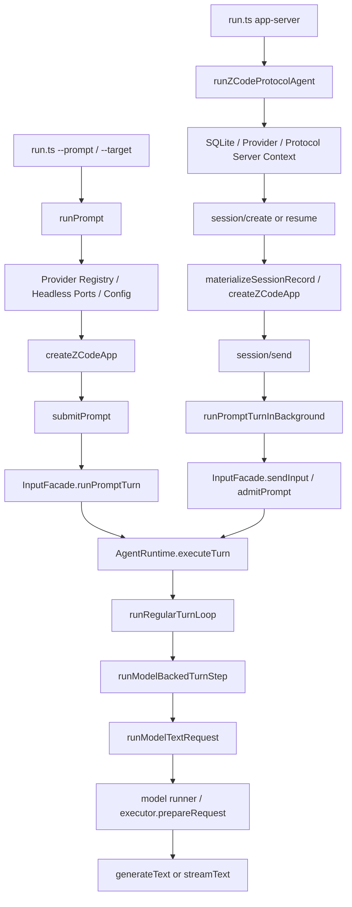

# ZCode Runtime 调用链

> Status: RESEARCH
> Date: 2026-10-05
> 基于固定官方提交的源码阅读结果。索引见 [README.md](README.md)。

来源固定为官方提交 `29628c9acdb81b703bbd4080c207a0e7ce5e276e`。以下源码链接均指该提交；安装版行为另见 [总报告](ZCODE_CLI_VS_APPSERVER.md)。

## 实际汇合点

**CONFIRMED — SOURCE：共同 Runtime/Core。** 一个易误读细节：CLI `submitPrompt → runPromptTurn` 直接进入 `executeTurn`；协议 `sendInput → admitPrompt → executeTurn`。不能把两入口都写成 `admitPrompt`。

## 逐级源码位置

| 层 | Native | app-server / 共享 |
|---|---|---|
| CLI 入口 | [run.ts L498](https://github.com/zai-org/ZCode/blob/29628c9acdb81b703bbd4080c207a0e7ce5e276e/apps/zcode-cli/packages/cli/src/run.ts#L498) prompt 分派 | 同文件 [L236](https://github.com/zai-org/ZCode/blob/29628c9acdb81b703bbd4080c207a0e7ce5e276e/apps/zcode-cli/packages/cli/src/run.ts#L236) `runZCodeProtocolCommand`、L537 server 分派 |
| 进程 bootstrap | [prompt-command.ts L194](https://github.com/zai-org/ZCode/blob/29628c9acdb81b703bbd4080c207a0e7ce5e276e/apps/zcode-cli/packages/cli/src/prompt-command.ts#L194) Provider / App 配置 | [zcode-protocol-entrypoint.ts L82](https://github.com/zai-org/ZCode/blob/29628c9acdb81b703bbd4080c207a0e7ce5e276e/apps/zcode-cli/packages/bootstrap/src/zcode-protocol-entrypoint.ts#L82)，SQLite L139、Provider L156、App 工厂 L249 |
| 创建 Runtime | [create-app.ts L726](https://github.com/zai-org/ZCode/blob/29628c9acdb81b703bbd4080c207a0e7ce5e276e/apps/zcode-cli/packages/bootstrap/src/app/create-app.ts#L726) | 相同 `new AgentRuntime` |
| 输入提交 | [input-facade.ts L369](https://github.com/zai-org/ZCode/blob/29628c9acdb81b703bbd4080c207a0e7ce5e276e/apps/zcode-cli/packages/bootstrap/src/app/input-facade.ts#L369) submitPrompt → L99 runPromptTurn | 同文件 [L193](https://github.com/zai-org/ZCode/blob/29628c9acdb81b703bbd4080c207a0e7ce5e276e/apps/zcode-cli/packages/bootstrap/src/app/input-facade.ts#L193) sendInput → admitPrompt |
| 协议 admission | 不经过此 Host 分派 | [server-operations.ts L1918](https://github.com/zai-org/ZCode/blob/29628c9acdb81b703bbd4080c207a0e7ce5e276e/apps/zcode-cli/packages/bootstrap/src/zcode-protocol/server-operations.ts#L1918) sendPrompt、L2360 background、L2410 sendInput |
| admitPrompt | CLI 本链不经过 | [prompt-admission.ts L20](https://github.com/zai-org/ZCode/blob/29628c9acdb81b703bbd4080c207a0e7ce5e276e/apps/zcode-cli/packages/core/src/runtime/methods/prompt-admission.ts#L20) → executeTurn |
| 共享 turn | [turn.ts L70](https://github.com/zai-org/ZCode/blob/29628c9acdb81b703bbd4080c207a0e7ce5e276e/apps/zcode-cli/packages/core/src/runtime/methods/turn.ts#L70) executeTurn | L614 regular loop；[turn-loop.ts L43](https://github.com/zai-org/ZCode/blob/29628c9acdb81b703bbd4080c207a0e7ce5e276e/apps/zcode-cli/packages/core/src/runtime/methods/turn-loop.ts#L43)、L205 model step |
| 共享 model step | [turn-model-step.ts L192](https://github.com/zai-org/ZCode/blob/29628c9acdb81b703bbd4080c207a0e7ce5e276e/apps/zcode-cli/packages/core/src/runtime/methods/turn-model-step.ts#L192) | model request、L235 runModelTextRequest |
| 模型执行 | [model.ts L36](https://github.com/zai-org/ZCode/blob/29628c9acdb81b703bbd4080c207a0e7ce5e276e/apps/zcode-cli/packages/core/src/runtime/methods/model.ts#L36) | messages/tools/signal/options L119；generate L142 / stream L228 |
| Provider/SDK | [adapters/model/model.ts L72](https://github.com/zai-org/ZCode/blob/29628c9acdb81b703bbd4080c207a0e7ce5e276e/apps/zcode-cli/packages/adapters/src/model/model.ts#L72) | executor.prepareRequest；[runner-runtime.ts L50](https://github.com/zai-org/ZCode/blob/29628c9acdb81b703bbd4080c207a0e7ce5e276e/apps/zcode-cli/packages/adapters/src/model/runner-runtime.ts#L50) Vercel AI SDK |

## Runtime materialization 的分叉

Native [prompt-command.ts L212–243](https://github.com/zai-org/ZCode/blob/29628c9acdb81b703bbd4080c207a0e7ce5e276e/apps/zcode-cli/packages/cli/src/prompt-command.ts#L212) 注入 browser、Provider Registry、default model、runtime auth headers、headless permission broker、runtimeConfig。公开源码设置 Workflow 为 `options.enableWorkflow===true`、Memory extraction 为 `options.memoryBench===true`、streaming=on。

协议 [server-operations.ts L3279](https://github.com/zai-org/ZCode/blob/29628c9acdb81b703bbd4080c207a0e7ce5e276e/apps/zcode-cli/packages/bootstrap/src/zcode-protocol/server-operations.ts#L3279) 的 materialize/createRecord 在 L3345+ 应用 startup preferences、session allow/disallowlist、Memory enabled override、协议 permission/browser broker、automation / subagent 端口。请求 `session/requestRuntimePreferences` 是 Host 往返；未回答或 answered preferences 不同，会改变 materialization。

**CONFIRMED — SOURCE：** Bridge 基线 [model-settings.ts](../../src/runtime/model-settings.ts) L339 固定关闭 Memory、native search enhancements、自动回答 AskUserQuestion。实际执行适配器也有同样回调，见本仓库 [zcode-app-server-adapter.ts](../../src/adapters/zcode-app-server-adapter.ts) L759 一带。权威是上述本机固定 HEAD 源码。

两边的 Provider Registry 启动来源共享；account access 还依赖 credential identity、snapshot revision、runtime headers。Browser、MCP、permissions 是能力端口，不是仅由注册工具名字决定的能力。

## Context与能力注入

- [core/context/builder.ts L149](https://github.com/zai-org/ZCode/blob/29628c9acdb81b703bbd4080c207a0e7ce5e276e/apps/zcode-cli/packages/core/src/context/builder.ts#L149)：Memory 注入；L177 skills，L193 workspace instructions；前面依次组织 stable identity / dynamic behavior / session guidance。系统、meta user、普通 history 必须分别比较。
- [adapters/context/index.ts](https://github.com/zai-org/ZCode/blob/29628c9acdb81b703bbd4080c207a0e7ce5e276e/apps/zcode-cli/packages/adapters/src/context/index.ts)：用户 `~/.zcode/AGENTS.md` 与祖先 workspace instructions 发现；同 cwd 也可能受用户目录和 storage/config 环境影响。
- [server-operations.ts L3348](https://github.com/zai-org/ZCode/blob/29628c9acdb81b703bbd4080c207a0e7ce5e276e/apps/zcode-cli/packages/bootstrap/src/zcode-protocol/server-operations.ts#L3348)：工具边界、startup preferences、MCP、能力 broker；工具注册与 permission policy 分开。
- [subagent/runner.ts L147](https://github.com/zai-org/ZCode/blob/29628c9acdb81b703bbd4080c207a0e7ce5e276e/apps/zcode-cli/packages/core/src/subagent/runner.ts#L147)：背景运行条件；L214 inactivity timeout，L653 autoBackground 配置。foreground/background 模型应查子会话实际 selection，不应从父会话模型推定。
- [project-memory-extraction.ts L32](https://github.com/zai-org/ZCode/blob/29628c9acdb81b703bbd4080c207a0e7ce5e276e/apps/zcode-cli/packages/core/src/runtime/helpers/project-memory-extraction.ts#L32)：disabled / memory root 等门槛，L115 extraction operation，L156 memory agent loop。**可能**产生额外模型请求；并非每个 turn 必然抽取。
- [headless-workflow.ts L31](https://github.com/zai-org/ZCode/blob/29628c9acdb81b703bbd4080c207a0e7ce5e276e/apps/zcode-cli/packages/cli/src/headless-workflow.ts#L31)：headless broker，仅特定 Workflow 工具自动允许；普通审批在 build 下可拒绝。

## 输出与结束判定

CLI 使用 Runtime Event subscriber 输出结构化 stream-json，最终 `result` 与进程退出构成 batch 执行的可观察边界。不是 terminal scraping。`runPrompt` 提交后还调用 [headless-workflow.ts L334](https://github.com/zai-org/ZCode/blob/29628c9acdb81b703bbd4080c207a0e7ce5e276e/apps/zcode-cli/packages/cli/src/headless-workflow.ts#L334) settle：观察到 Workflow activity 后等待背景任务与 active/queued turn work，无内部固定总超时，应由外层 supervisor 约束。Memory bench 另行 drain。

协议 `session/send` ACK 仅表明 admission；terminal 从 session/event 读取。Bridge 现有适配器 L804–831 按 session/turn/seq 过滤，在 `turn.completed` resolve 当前 prompt；L580+ checkpoint 后执行 cleanup。其资源清理已有设计，不能把现状描述成“没有进程控制”。未发现与 CLI 相同的 Workflow settle 收口；这支持背景能力开启时存在风险，尚未复现漏收完整 Workflow 的实际故障。

Core shared、Host distinct 的结论并不推出默认工具、prompt、model options、资源成本或 task terminal 一定相同。
